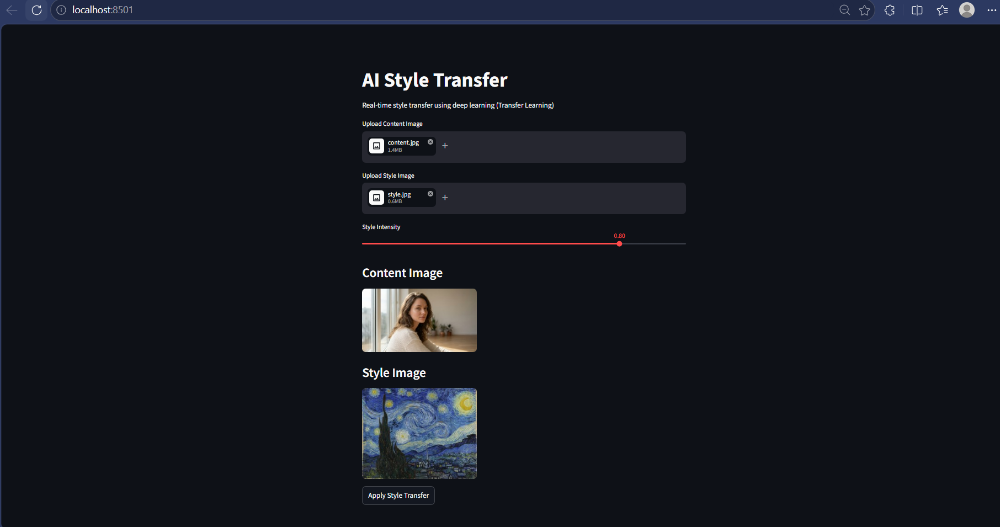
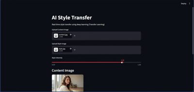

# Image Style Transfer 

An interactive web application that applies artistic styles to images using deep learning.  
This project leverages **transfer learning** to perform fast neural style transfer and allows users to control style intensity in real time.


## Features

- ⚡ Real-time style transfer (1–2 seconds)
- 🎚️ Adjustable style intensity (0% → 100%)
- 🖼️ Upload custom content and style images
- 🧠 Uses pretrained deep neural networks (Transfer Learning)
- 💻 Interactive UI built with Streamlit


## Concepts Used

- Transfer Learning (VGG-based architecture)
- Neural Style Transfer
- Feature Extraction using CNNs
- Image Processing with TensorFlow

## Project Structure

```

project/
├── app.py # Fast real-time style transfer UI
├── main.py # Baseline (optimization-based NST)
├── content.jpg # Sample content image
├── style.jpg # Sample style image
├── README.md

```

## Two Approaches Implemented

| Approach | Description | Time |
|--------|------------|------|
| Optimization-based (baseline.py) | Iterative pixel optimization | 5–6 minutes |
| Fast NST (app.py) | Feed-forward pretrained model | 1–2 seconds |


## Installation

Clone the repository locally.

```bash
git clone https://github.com/Atharv-Bandekar/ImageStyleTransfer.git
```

Create a virtual environment in the root directory.

```bash
python -m venv venv
```

Activate the virtual environment.

```bash
./venv/Scripts/Activate
```

Install requirements.

```bash
pip install -r requirements.txt
```

Run app.py

```bash
streamlit run app.py
```

## Screenshot




## Demo



